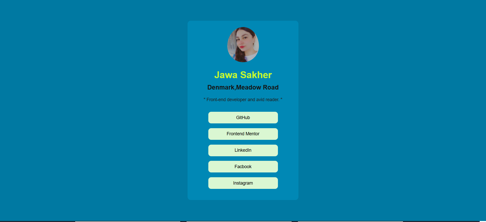

# Social Links Profile

A modern, scalable, and production-ready Social Links Profile application built with React and Vite.

  

---

## Overview

This project demonstrates modern frontend engineering principles including:

- Component-based architecture
- Clean and maintainable code structure
- Responsive UI design
- Optimized production builds
- Accessibility-aware implementation

The application presents a professional profile card with interactive social media links in a minimal and visually polished layout.

---

## Tech Stack

- React 19
- Vite
- Modern JavaScript (ES Modules)
- CSS
- ESLint

---

## Architecture

The project follows a structured and scalable folder organization:

Social-Links-Profile/
│
├── public/
│   └── social-preview.png
│
├── src/
│   ├── components/
│   │   └── Card.jsx
│   ├── App.jsx
│   ├── main.jsx
│   └── styles.css
│
├── index.html
├── package.json
├── vite.config.js
└── README.md
The architecture ensures:

- Clear separation of concerns
- Reusable UI components
- Maintainable codebase
- Scalable structure for future expansion

---

## Installation

Clone the repository:

git clone https://github.com/jawasakher/Social-Links-Profile.git
Install dependencies:

npm install
Run development server:

npm run dev
Local server runs at:

http://localhost:5173
---

## Production Build

Generate optimized production assets:

npm run build
Preview production build:

npm run preview
---

## Engineering Focus

This project emphasizes:

- Performance optimization through Vite bundling
- Clean UI implementation
- Responsive design principles
- Structured component abstraction
- Readable and scalable frontend architecture

---

## Future Enhancements

- TypeScript migration
- Unit testing integration
- CI/CD pipeline setup
- Accessibility audit improvements
- Dark mode support

---

## License

MIT License

---

## Author

Jawa Sakher  
GitHub: https://github.com/jawasakher

---

This project reflects a foundational approach toward building production-grade frontend applications using modern tooling and engineering discipline.
